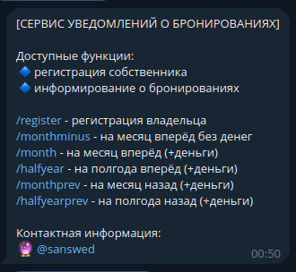
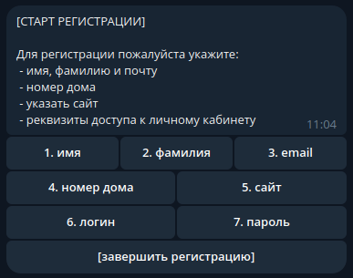
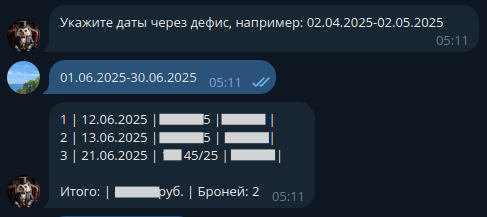
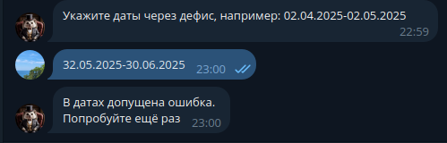

| badge  | description                           | 
|------------------------------------------------------------------------------------------------------------------------------------------------------------------------------------|---------------------------------------|
|  | индикатор сборки и запуска тестов     |
|                            | уровень поддерживаемости кодовой базы |
|                                     | индекс покрытия тестами кодовой базы  |

# СЕРВИС УВЕДОМЛЕНИЙ О БРОНИРОВАНИЯХ
Телеграм бот информирует собственника о бронях объекта недвижимости.

Для получения уведомлений необходимо:
 - [x] зарегистрироваться
 - [x] отправить запрос о брони (за период: месяц, полгода)

## постановка проблемы
Объекты недвижимости, которые передаются в управление специализированным компаниям, бронируются либо в ручном режиме, либо автоматизированном. Во втором случае используются нишевые решения, так называемые PMS-системы. 
Если у владельца один объект или несколько, и все они обслуживаются одной компанией, то с большой долей вероятности проблемы не существует.

Но когда объектов несколько и каждый из них передан разным компаниям и при этом, собственнику нужно самостоятельно следить за бронями, то ситуация осложняется.
Владелец вынужден не менее 2-х раз в день авторизовываться в каждую из PMS-систем и контролировать текущий статус. Что доставляет дискомфорт из-за необходимости помнить адреса систем, логины и пароли.

## целевая аудитория
Собственники объектов недвижимости, или нанятые ими управляющий, которые имеют хотя бы одну из проблем:
- [x] несколько объектов недвижимости. Каждый (или часть) из которых в разных PMS-системах;
- [x] необходимость самостоятельной подготовки объекта к приезду гостя и организации уборки после выезда;
- [x] потребность регулярного получения общего отчёта по броням по всем домам за произвольный период времени. 

## целеполагание
Сервис уведомлений должен позволять с минимальным количеством кликов получить необходимую информацию по броням. Сервис должен быть безопасным, устойчивым к попыткам несанкционированного доступа.
\
Ключевые задачи сервиса: 
1. Удобная разовая авторизация
2. Быстрый доступ к статистике броней
3. Защита чувствительных данных

## реализация
Для снижения порога входа, в качестве графического интерфейса выбран телеграм бот - не требует скачивания и инсталляции отдельного приложения, кроме самого Телеграма. У большинства он уже установлен.
\
Для работы с ботом требуется пройти регистрацию. Процедура занимает 4 минуты и состоит из 7 шагов:
 - имя
 - фамилия
 - email
 - номер дома
 - сайт
 - логин
 - пароль

После активации аккаунта становятся доступны команды для получения уведомлений о бронях.

## как это работает
Пользователь отправляет команду боту, который в свою очередь запускает специальную процедуру обращения к PMS-системе.
В ответ на обращение PMS-система отправляет данные в определённом формате.
\
Далее, сервис обрабатывает этот ответ и результат высылает в телеграм бот в удобном и понятном виде. У пользователя есть различные опции для запроса информации о бронях:
- брони за месяц вперёд
- брони за полгода вперёд
- брони за месяц назад
- брони за полгода назад
- брони за указанный период времени
- брони без упоминания денег

## демо

|      |                                                                | 
|:---------------------------------------------------------------:|:--------------------------------------------------------------:|
|                  |   |
|              |               |

## ограничения
С целью тестирование бизнес-гипотез была реализована минимальная версия сервиса, которая включает 2 ключевых функции: регистрация и информирование о бронях.
\
Кроме того, сервис позволяет иметь только один дом с указанием одной площадки (PMS-системы). 

По результатам тестирования будет принято решение о целесообразности в дальнейшем развитии данного сервиса.И реализации расширенного спектра функциональных возможностей.
В настоящий момент, сервис развёрнут на продуктивной среде и доступен 24/7.

## технологический стек
**Разработка**:
\
java 19
Spring Boot 3.4.0, Spring Data, Spring Security (jwt) - реализована возможность аутентификации
Postgresql
Jsoup - применяется для парсинга HTML-страниц
Telegrambots  - внешняя библиотека от telegram.org
Gradle - система сборки проекта

**Тестирование**:
\
JUnit - библиотека для автоматизации написания unit-тестов
Mockito - библиотека для автоматизации интеграционных тестов с выборочным применением моков
Jacoco - библиотека для оценки степени покрытия кода тестами

**Удалённая непрерывная интеграция (CI)**:
\
GitHub + Actions

**Развёртывание (CD)**:
\
Docker, Container, PaaS (выделенный виртуальный сервер)